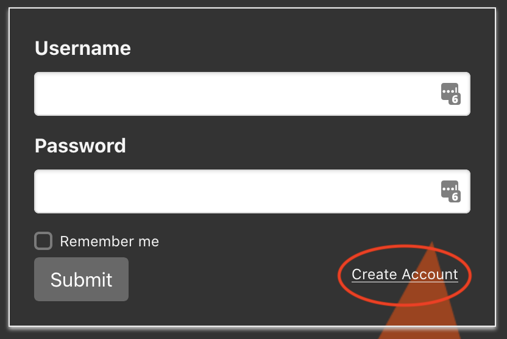
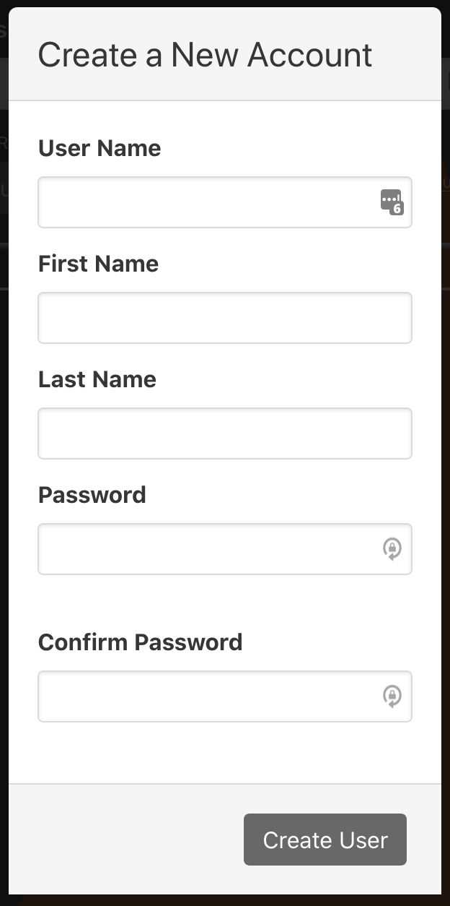
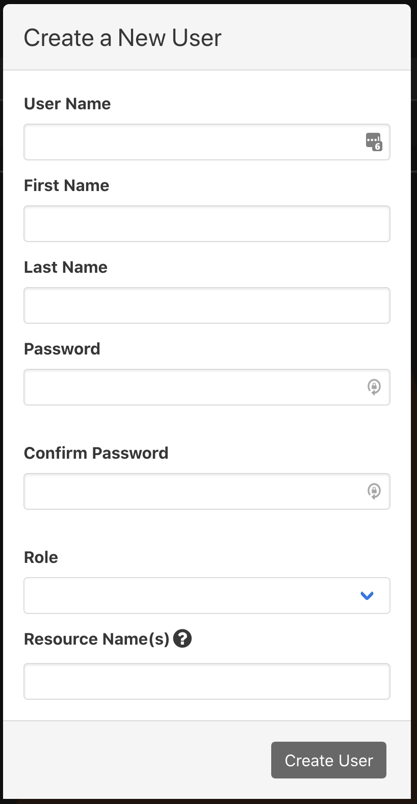

# User Administration in phēnix

## Create a new user

There are two primary ways to create new users. 

1. Choose the `Create Account` link off the login page and complete all fields one the `Create a New Account` dialogue. This will initiate a message to an administrator's account who can then activate the account, setting the role(s) and resource name(s).

<p align="center">
    
</p>

<p align="center">
    
</p>

2. From the `Users` tab, click the `+` button to `create a new user`. Here the administrator will add the role(s) and resource name(s). 

<p align="center">
    
</p>
<br>

## Login

The login page is self-descriptive. Using the `Remember me` checkbox will set a token to local storage so that you can remove the requirement to enter a `Username` and `Password` each time the page or site is reloaded. 

If an administrator starts the UI server with the following command, authentication is enabled:

```
$> phenix ui -k <some_string>
```

Without the `-k` (or `--jwt-signing-key`), authentication is disabled.
<br>

## User Administration

### Updating users

An administrator is able to click on the username on the table in the Users tab to update a user. They can update `First Name` or `Last Name`, `Role`, or `Resource Name(s)`.
<br>

### Role

`Global Admin` is the administrator level account and has access to all capabilities, to include user management. They also have access to all resources.

| Role              | Limits | List | Get | Create | Update | Patch | Delete | Users |
|-------------------|:-------|:----:|:---:|:------:|:------:|:-----:|:------:|:-----:|
| Global Admin      | Can see and control absolutely anything/everything. | ✔︎ | ✔︎ | ✔︎ | ✔︎ | ✔︎ | ✔︎ | ✔︎ |
| Global Viewer     | Can see absolutely anything/everything, but cannot make any changes. | ✔︎ | ✔︎ |  |  |  |  | ✔︎ |
| Experiment Admin  | Can see and control anything/everything for assigned experiments, including VMs, but cannot create new experiments. | ✔︎ | ✔︎ |  | ✔︎ | ✔︎ | ✔︎ |  |
| Experiment User   | Can see assigned experiments, and can control VMs within assigned experiments, but cannot modify experiments themselves. | ✔︎ | ✔︎ |  | ✔︎ | ✔︎ |  |  |
| Experiment Viewer | Can see assigned experiments and VMs within assigned experiments, but cannot modify or control experiments or VMs. | ✔︎ | ✔︎ |  |  |  |  |  |
| VM Viewer         | Can only see VM screenshots and access VM VNC, nothing else. |  | ✔︎ |  |  |  |  |  |
<br>

### Resource Name(s)

**TODO**: describe what a resource is and how wildcards can be used.