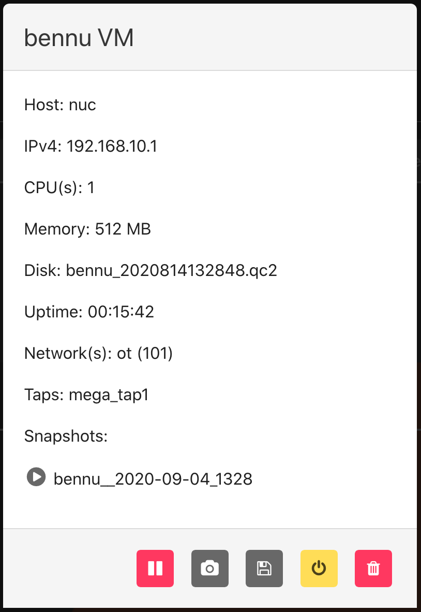

# VMs
<br>

## VM Info
<br>

### From the Web-UI

The experiment must be started; click on the experiment name to enter the Running Experiment component. Within that component, click on the VM name and you will be presented with a VM information dialogue.

<p align="center">
    
</p>
<br>

### From the Command Line Binary

There are two options for displaying the information for VMs in an experiment. First run the following command to see information for all VMs in a given experiment.

```
~# phenix vm info <experiment name>
```
Or ... run the following to see the information for a specific VM in an experiment.
```
~# phenix vm info <experiment name>/<VM name>
```
<br>

## Pause a VM
<br>

### From the Web-UI

Click on the name of a running VM in a started experiment to access the VM information dialogue. To pause a VM, click on the pause button (furthest button to the left). To start a paused VM, that same button will become a green play button; simply click it to start.

### From the Command Line Binary

To pause a VM, run the following command.

```
~# phenix vm pause <experiment name> <VM name>
```
To resume a paused VM, run the following command.
```
~# phenix vm resume <experiment name> <VM name>
```
<br>

## Redeploy a VM
<br>

### From the Web-UI

Click on the name of a running VM in a started experiment to access the VM information dialogue. To redeploy a VM, click on the redeploy button (second from the right).

### From the Command Line Binary

To redploy a VM, run the following command.

```
~# phenix vm redeploy <experiment name> <VM name>
```
<br>

